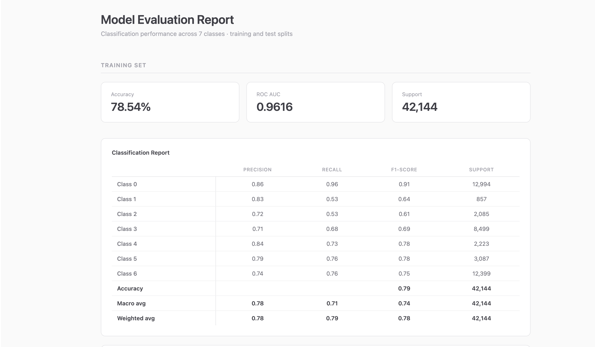
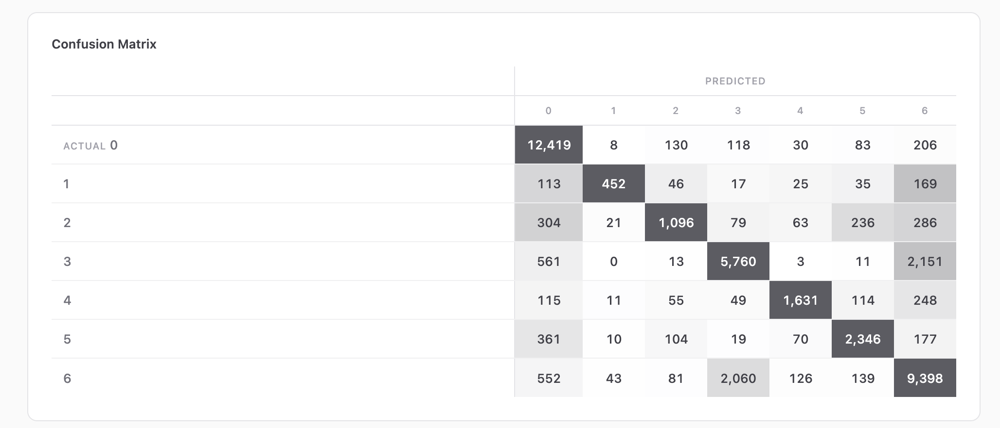
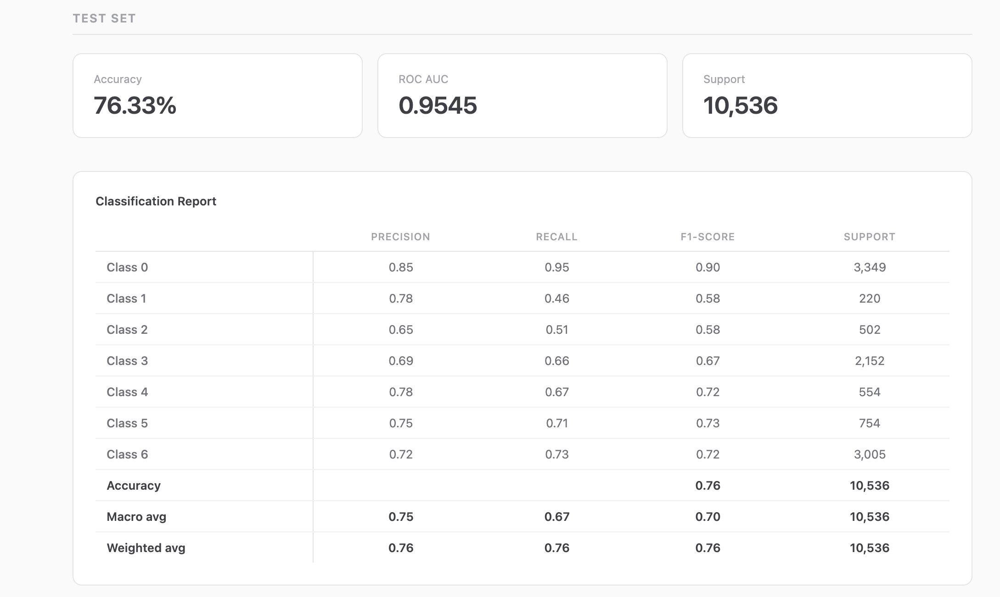
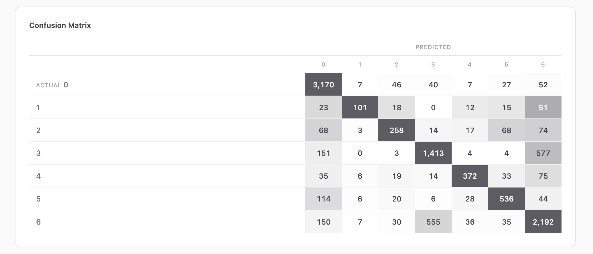
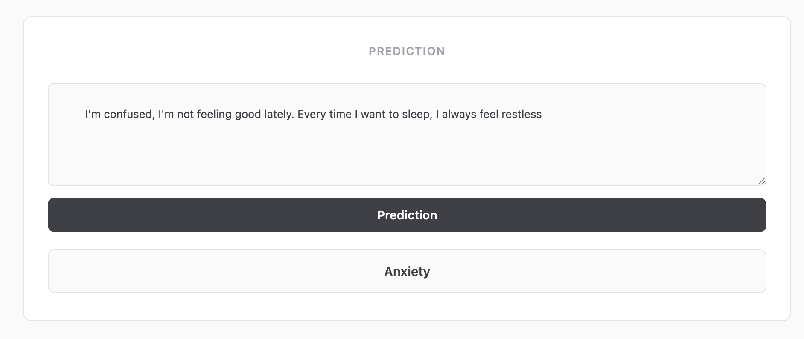

# Sentiment Analysis — Mental Health Status Classification

##  Introduction

This project analyzes user-generated text — statements, messages, or social media posts — to identify the underlying mental health condition being expressed. Using Natural Language Processing (NLP) and Machine Learning, the model classifies a given piece of text into one of six mental health statuses:

- **Anxiety**
- **Normal**
- **Depression**
- **Personality Disorder**
- **Suicidal**
- **Bipolar**

The goal is to build a system that can process raw, unstructured social media text and flag the emotional/psychological state of the author. Such a system has real-world value in areas like:

- Early detection of at-risk individuals on social platforms
- Mental health monitoring and support tools
- Research on public mental health trends
- Assisting moderators/counselors in prioritizing outreach

>  **Disclaimer:** This project is for educational and research purposes only. It is **not** a diagnostic tool and should never be used as a substitute for professional medical or psychological evaluation.

---

##  Dataset

- **Source:** [Kaggle](https://www.kaggle.com/)
- **Input Feature:** `statement` — a text post/message from a social media user
- **Target Feature:** `status` — the mental health category (Anxiety, Normal, Depression, Personality Disorder, Suicidal, Bipolar)

| Split | Size |
|-------|------|
| Train | 42,000 samples |
| Test  | 10,000 samples |

---

##  Project Pipeline (ETL-based)

The project follows a complete **ETL (Extract, Transform, Load)** approach, with an end-to-end pipeline built for both **training** and **prediction**:

1. **Extract** — Load raw dataset from Kaggle source
2. **Transform**
   - Text cleaning (lowercasing, removing punctuation, stopwords, special characters, links, etc.)
   - Tokenization
   - Feature extraction / vectorization (e.g., TF-IDF)
   - Label encoding of target classes
3. **Load**
   - Feed processed data into the ML pipeline
   - Train the classification model
   - Persist the trained pipeline (vectorizer + model) for reuse in predictions

This pipeline design ensures that new/unseen text can be passed directly through the same preprocessing → vectorization → prediction flow used during training, keeping training and inference consistent.

---

##  Model Performance

### Training Results
| Metric | Score |
|--------|-------|
| Accuracy | 0.77 |
| ROC-AUC | 0.95 |

**Classification Report (Train)**

**Confusion Matrix (Train)**

---

### Test Results
| Metric | Score |
|--------|-------|
| Accuracy | 0.76 |
| ROC-AUC | 0.94 |

**Classification Report (Test)**

**Confusion Matrix (Test)**

---

### Sample Prediction

>  Note: Place the corresponding image files inside an `images/` folder in the repository root, using the filenames referenced above (or update the paths to match your actual file names).

---

##  Libraries & Tools

- **scikit-learn** — Model building, evaluation metrics (accuracy, ROC-AUC, classification report, confusion matrix)
- **pandas** — Data loading and manipulation
- **numpy** — Numerical computations
- **sql** - Database
---

##  Future Improvements

- **Hyperparameter Tuning** — Use GridSearchCV / RandomizedSearchCV / Optuna to optimize model parameters for better generalization
- **Deep Learning Algorithms** — Explore LSTM, GRU, or Transformer-based models (BERT, RoBERTa, DistilBERT) for richer contextual understanding of text
- **Advanced Text Embeddings** — Move beyond TF-IDF to word embeddings (Word2Vec, GloVe) or contextual embeddings
- **Class Imbalance Handling** — Apply SMOTE, class weighting, or oversampling/undersampling techniques if classes are imbalanced
- **Cross-validation** — Use k-fold cross-validation for a more robust performance estimate

*Built with scikit-learn, pandas, and numpy — a complete ETL-driven ML pipeline for mental health status classification from social media text.*